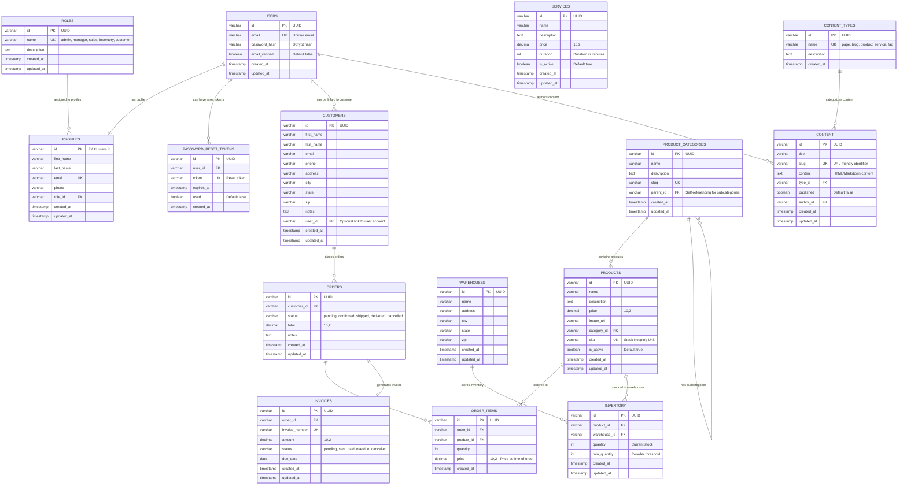

# Payoff Solar - Data Model

This document describes the complete data model for the Payoff Solar CRM/CMS application, including all entities, relationships, and business rules.

## Overview

The Payoff Solar data model is designed to support:
- **User Management** - Authentication, roles, and profiles
- **Customer Relationship Management (CRM)** - Customer data and interactions
- **Product Catalog** - Solar products and categories
- **Inventory Management** - Multi-warehouse inventory tracking
- **Order Management** - Sales orders and order items
- **Invoice Management** - Billing and payment tracking
- **Service Management** - Installation and maintenance services
- **Content Management System (CMS)** - Website content and blog

## Entity Relationship Diagram

## Entity Descriptions

### User Management

#### USERS
Core authentication table replacing Supabase auth.users
- **id**: UUID primary key
- **email**: Unique email address for login
- **password_hash**: BCrypt hashed password
- **email_verified**: Email verification status

#### ROLES
Role-based access control system
- **Roles**: admin, manager, sales, inventory, customer
- **admin**: Full system access
- **manager**: Access to most features except system settings
- **sales**: Customer and order management
- **inventory**: Product and inventory management
- **customer**: Self-service portal access

#### PROFILES
Extended user information and role assignment
- Links to USERS table (1:1 relationship)
- Contains personal information and role assignment
- Separate from USERS for flexibility

#### PASSWORD_RESET_TOKENS
Secure password reset functionality
- Time-limited tokens for password reset
- Single-use tokens with expiration

### Customer Management

#### CUSTOMERS
Customer relationship management
- Complete contact information
- Optional link to user account for self-service
- Notes field for sales team annotations

### Product Catalog

#### PRODUCT_CATEGORIES
Hierarchical product categorization
- Self-referencing for subcategories
- URL-friendly slugs for e-commerce

#### PRODUCTS
Solar product catalog
- SKU-based inventory tracking
- Category association
- Active/inactive status for lifecycle management

### Inventory Management

#### WAREHOUSES
Multi-location inventory support
- Physical warehouse locations
- Address information for shipping calculations

#### INVENTORY
Product stock levels by warehouse
- Current quantity tracking
- Minimum quantity thresholds for reorder alerts
- Unique constraint on product-warehouse combination

### Order Management

#### ORDERS
Sales order tracking
- Customer association
- Status workflow: pending → confirmed → shipped → delivered
- Total amount calculation

#### ORDER_ITEMS
Individual line items within orders
- Product association with quantity
- Price at time of order (historical pricing)

### Invoice Management

#### INVOICES
Billing and payment tracking
- One-to-one relationship with orders
- Invoice numbering system
- Due date tracking
- Status workflow: pending → sent → paid

### Services

#### SERVICES
Installation and maintenance services
- Service catalog with pricing
- Duration tracking for scheduling
- Active/inactive status

### Content Management

#### CONTENT_TYPES
Content categorization system
- **page**: Static website pages
- **blog**: Blog posts and articles
- **product**: Product descriptions
- **service**: Service descriptions
- **faq**: Frequently asked questions

#### CONTENT
CMS content storage
- URL-friendly slugs
- Published/draft status
- Author tracking
- Rich text content support

## Business Rules

### Data Integrity
1. All primary keys use UUID for security and distribution
2. Foreign key constraints maintain referential integrity
3. Unique constraints prevent duplicate data
4. Timestamps track creation and modification

### Security
1. Passwords stored as BCrypt hashes
2. Email verification required for user accounts
3. Role-based access control
4. Secure password reset tokens

### Inventory Management
1. Inventory tracked per warehouse
2. Minimum quantity thresholds for reorder alerts
3. Product-warehouse combinations must be unique

### Order Processing
1. Orders must have associated customers
2. Order items preserve historical pricing
3. Invoices generated from orders
4. Status workflows enforce business processes

### Content Management
1. Content requires author attribution
2. Slug uniqueness for SEO
3. Published status controls visibility
4. Content type categorization

## Indexes

Performance optimization indexes are created for:
- Customer email lookups
- Product SKU searches
- Inventory queries by product/warehouse
- Order queries by customer/status
- Content queries by type/author
- Password reset token lookups

## Future Enhancements

Potential additions to the data model:
1. **Quotes/Estimates** - Pre-order pricing
2. **Payments** - Payment transaction tracking
3. **Shipping** - Delivery tracking
4. **Appointments** - Service scheduling
5. **Documents** - File attachments
6. **Audit Logs** - Change tracking
7. **Notifications** - System alerts
8. **Reports** - Saved report configurations
